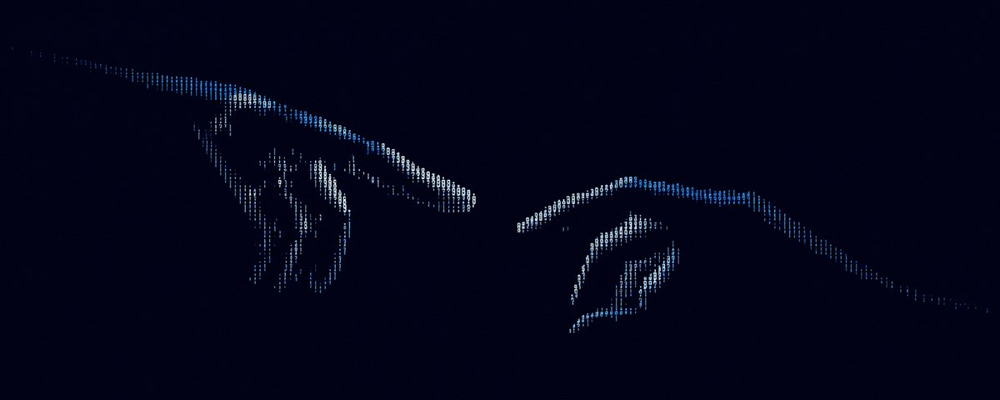

<div align="center">
  

  <h1>Victor Gotfrid</h1>
  <p><strong>Web Developer · UX/UI Designer</strong></p>
  <p>I design and build professional websites and digital experiences where strategy, usability and technology work together.</p>

  <p>
    <a href="https://www.linkedin.com/in/victorgrcabral"></a>
    <a href="mailto:victorgrcabral@gmail.com"></a>
    <a href="https://instagram.com/victorgotfrid"></a>
  </p>
</div>

## What I do

I turn complex ideas and businesses into clear, responsive web experiences — from information architecture and interface design to front-end implementation.

- Professional websites and landing pages
- UX/UI and design systems
- Responsive front-end development
- Performance, accessibility and conversion-focused improvements
- Brand consistency across digital touchpoints

## Selected work

### [bidbento.lol](https://bidbento.lol)

A real-time visual advertising experiment that transforms investment into proportional screen space using a squarified treemap layout.

`Next.js` · `React` · `TypeScript` · `Prisma` · `PostgreSQL` · `Stripe`

[View repository →](https://github.com/victorgrcabral/bidbento.lol)

### [INTERFUSÃO](https://interfusao.com.br)

A corporate web experience for the industrial and mining market, structured to make a complex portfolio easier to navigate and connect technical content with business enquiries.

`Web Design` · `UX/UI` · `WordPress` · `Content Architecture` · `Conversion`

[Visit website →](https://interfusao.com.br)

## Tools & technologies

<p>
  
</p>

## How I work

```text
understand the problem → structure the experience → design the interface → build → validate
```

I care about clear communication, thoughtful details and websites that are as useful as they are visually distinctive.

<div align="center">
  <strong>Have a project in mind?</strong><br />
  <a href="mailto:victorgrcabral@gmail.com">Let's talk.</a>
</div>

